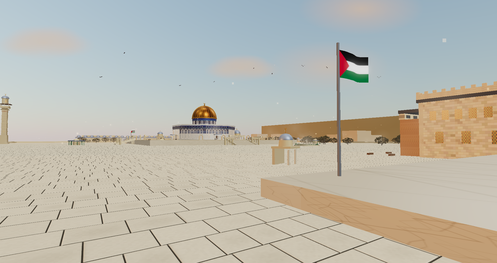
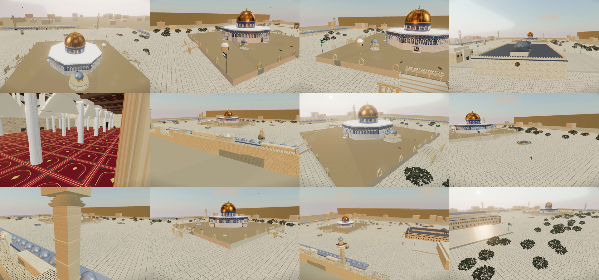
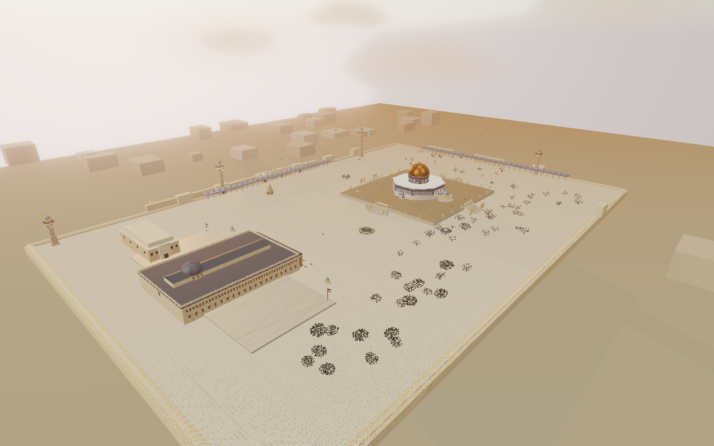
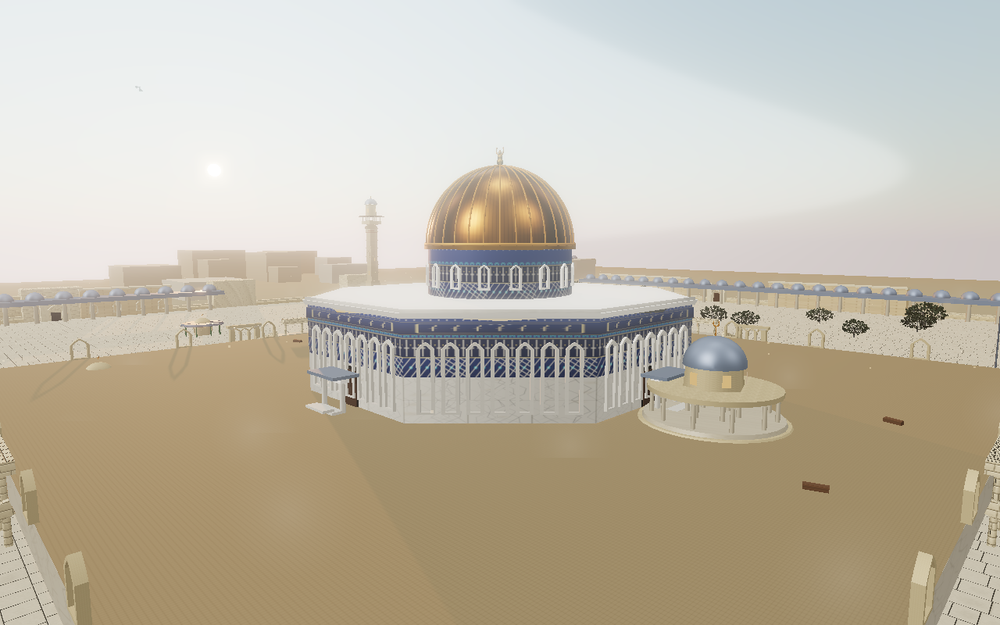
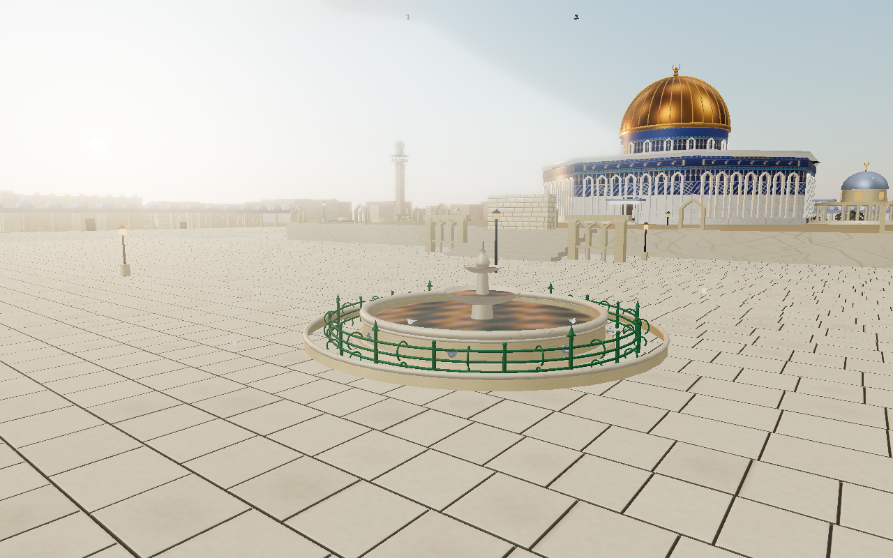
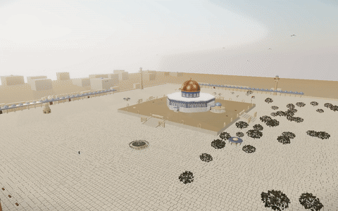

# Al-Aqsa compound in 3D

Play it: https://al-aqsa-compound.pages.dev/ 
Walk the Haram al-Sharif in the browser. Dome of the Rock, Qibli mosque, the small domes, four minarets, sabils, olive gardens. Twelve gold markers tell the history of each stop, or take the guided tour.

Built with three.js r170. No build step.

## Run it yourself

1. `git clone https://github.com/hassenhamdi/al-aqsa-compound.git`
2. `cd al-aqsa-compound && python3 -m http.server 8099`
3. Open `http://localhost:8099/index.html`

First visit downloads three.js from a CDN and caches it, so repeat loads work offline.

## Controls

F enters photo mode. Click a gold marker for its story.
- Orbit, walk, FPS (V toggles), cinematic, guided tour
- WASD + Shift run, Space jump, E enter a mosque
- Dawn, noon, sunset, night lighting; auto, high, med, low quality

The tour follows the events thread: Isra, the qibla turn, Umar, Saladin, 1969, the living sanctuary today.

## What is in the repo

- `content/lessons.md`: the twelve stop texts the tour reads
- `references/`: 48 grounded photos with an index
- `tracks/`: one spec per building (objective, checklist, acceptance views)
- `docs/`: per-task logs, verification shots, both videos
- `AGENTS.md`: how the subagents split the work; `KIRO.md`: exam evidence map

Capture your own shots: `node scripts/shot-dgpu.mjs "<url>?nohud=1&view=N" shots/x.png`. Record a flyover: R in photo mode, then `node scripts/make-video.mjs <traj.json>`.
